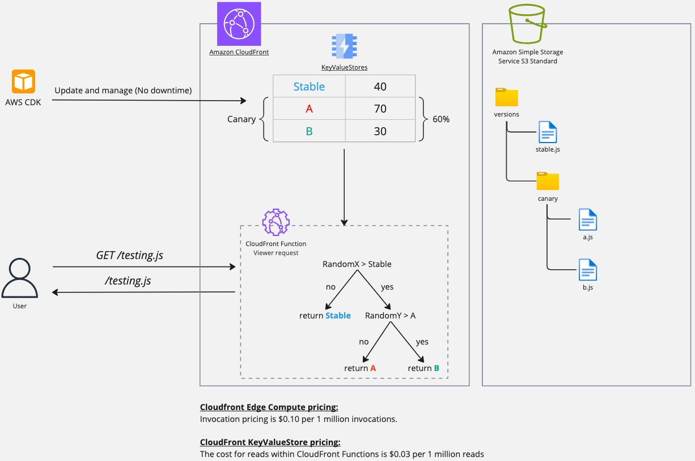

# Cloudfront A/B testing using edge function

A simple demo of edge A/B testing (or canary deployments technique) using cloudfront function and KeyValueStore.
According to the following architecture, each request will reach to cloudfront and pass through a viewer request
cloudfront function. The function uses a KeyValueStore which store the versions and their percentage (see diagram
below), then it run a simple logic for random version decision and finally manipulate the request uri and replace it
with the relevant chosen version file from S3.

See demo: https://d2vlo5pi7cnau.cloudfront.net

Or if you just want to see the `testing.js` script that actually changing (by refresh) across different A/B
result: https://d2vlo5pi7cnau.cloudfront.net/testing.js

For more about the implementation and AWS resources used for this Cloudfront A/B testing see [CDK folder](./cdk).

### Architecture diagram:

https://miro.com/app/board/uXjVKGX4r18=/?share_link_id=19873269490
